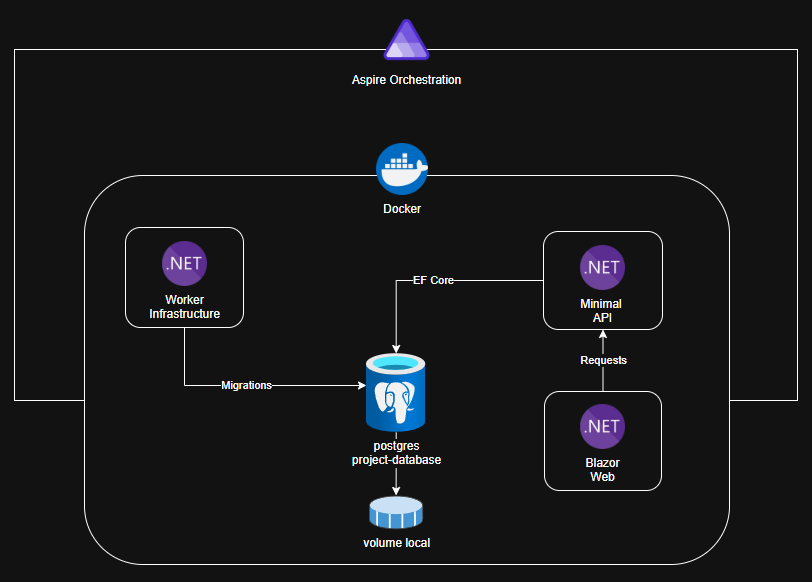
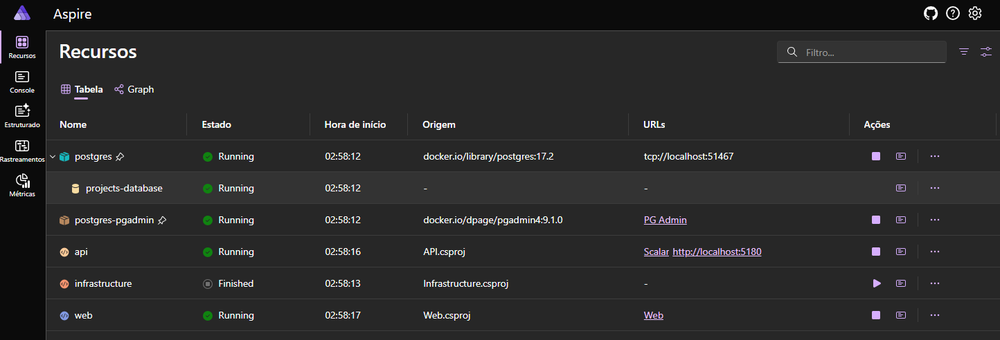
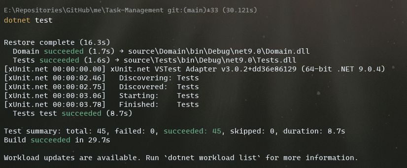
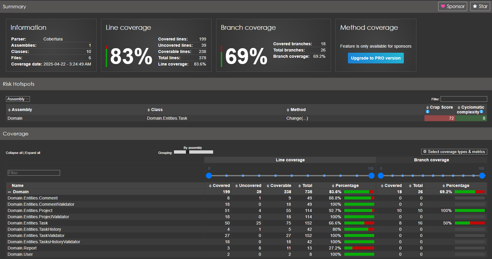

# Task Management (Gerenciamento de Tarefas)

Este repositório contém um projeto com uma solução de gerenciamento de tarefas.  

## Índice

- [Descrição do Projeto](#descrição-do-projeto)
- [Funcionalidades](#funcionalidades)
- [Arquitetura](#arquitetura)
- [Testes](#testes)
- [Instruções](#instruções)
- [Questionamento](#questionamento)
- [Melhorias](#melhorias)


---

## Descrição do Projeto

Este projeto foi desenvolvido para demonstrar uma aplicação focada no backend para o gerenciamento de tarefas, disponibilizando todas as funcionalidades em forma de API.  
Este projeto utiliza padrões de arquitetura como DDD (Domain-Driven Design) visando uma separação clara entre as camadas de apresentação, domínio e infraestrutura.  

Todo desenvolvimento foi organizado com issues e os commits associados pelo projeto github:
[Github Project](https://github.com/users/vldmatos/projects/2/views/1)

## Funcionalidades

1. **Listagem de Projetos** - listar todos os projetos do usuário
2. **Visualização de Tarefas** - visualizar todas as tarefas de um projeto específico
3. **Criação de Projetos** - criar um novo projeto
4. **Criação de Tarefas** - adicionar uma nova tarefa a um projeto
5. **Atualização de Tarefas** - atualizar o status ou detalhes de uma tarefa
6. **Remoção de Tarefas** - remover uma tarefa de um projeto

## Arquitetura

Abaixo um desenho da arquitetura do projeto


Toda Stack com suporte a container e orquestração com Aspire.


### Projetos das arquitetura
Projetos que compoem a arquitetura da solução:
- **Aspire Orchestration**: Responsável pela orchestração dos projetos e containers.
- **Docker**: Plataforma de containers para execução dos projetos e containers de suporte.
- **.Net 9 Minimal API**: Projeto de API.
- **.Net 9 Blazor App**: Web para utilizar a API.
- **.Net 9 Worker Services**: Projeto de Infraestrutura para aplicar as migrações de banco de dados.
- **Container PostgresSQL**: Container com banco de dados de projetos e volume local.

### Componentes
Este projeto utiliza alguns componentes para facilitar o desenvolvimento e a manutenção:
- **EF Core**: ORM para manipulação de contexto de dados.
- **FluentValidation**: Para validação de dados das entidades.
- **Coverlet**: Para geração de dados de cobertura de testes.
- **Scalar**: Para documentação de APIs.
- **Tailwindcss**: Para o projeto Web.
- **OpenTelemetry**: Para monitoramento e rastreamento de chamadas entre os serviços.

### Tools
Alguns ferramentas não sao obrigatórias, mas foram utilizadas no desenvolvimento:
- **EF Tools**: Para geração de migrações e manipulação do banco de dados.
- **Dotnet Report Generator**: Para geração de relatórios de cobertura de testes.

### Pre-requisitos Técnicos
- .Net 9 SDK e Runtime
- Visual Studio 2022 ou VS Code
- Docker Desktop
- Git

### Detalhes da Implementação
1. **Utilização de Endpoints protegidos:**
    - A API utiliza autenticação JWT para proteger os endpoints.
    - Existem dois endpoints que simulam os logins com usuários regular e manager, estes endpoints retornam o token JWT.
        - /account/login/regular
        - /account/login/manager

2. **Tratamento de Exceções:**
    - A solução tem uma captura de exceções global.
    - Toda exceção de regra é retornada no padrão problem details.

3. **Mapeamento de Endpoints Automaticos:**
    - Foi implementada uma interface de endpoint para mapear os endpoints automaticamente.
    
4. **Implementação de validações e regras na camada de dominio:**
    - A camada de dominio centraliza as regras de negocio e validações, para facilitar na manutenção e testes.

5. **Implementação RateLimits:**
    - Os endpoints tem limites de requisições, para proteção do back-end.

6. **Os projetos tem suporte a Build Container .NET:**
    - Execução de container, sem a necessidade de dockerfile.
    - Execução de build e execução de containers com o comando:
    ```bash
    dotnet publish --os linux --arch x64 /t:PublishContainer
    ```

7. **Migrations to Database:**
    - O projeto de Worker Services tem a responsabilidade de aplicar as migrações no banco de dados.
    - Para gerar novas migrações, caso modifique entidades ou estrutura de tabelas executar:
    ```bash
    dotnet ef migrations add XXX --project source/Configurations/Configurations.csproj --startup-project source/Infrastructure/Infrastructure.csproj --output-dir Data/Migrations
    ```

8. **O projeto Web Utiliza tailwindcss**
    - o css final ja foi gerado para aplicação.
    - caso seja realizada alguma alteração e precise gerar novamente o output executar o comando na pasta do projeto web:
    ```bash
    npx @tailwindcss/cli -i ./wwwroot/css/web.css -o ./wwwroot/css/web.output.css --watch --minify
    ```

9. **Endpoints Health:**
    - As aplicações Web e API tem endpoints de health para verificar a integridade do sistema.
    - Podem ser utilizados por ferramentas de monitoramento
    - Endpoint:
        - /health
        - /alive
        - /health/detailed
    
## Testes
Este projeto possui testes unitários para garantir a qualidade do código. 
Voce pode instalar a ferramenta de geração de relatórios de cobertura de testes, caso não tenha instalado, se desejar com o comando:
```bash
dotnet tool install --global dotnet-reportgenerator-globaltool
```
Para executar os testes com cobertura de código, utilize o seguinte comando:
```bash
dotnet test --collect:"XPlat Code Coverage"
```
Isso irá gerar o xml com dados de cobertura de teste.  
Após isso, você pode gerar um relatório HTML com o seguinte comando:
```bash
reportgenerator "-reports:source\Tests\TestResults\[FolderGeneratedCoverlet]\coverage.cobertura.xml" "-targetdir:coveragereport" -reporttypes:Html
```

***Para apenas executar os testes utilize o seguinte comando:***
```bash
dotnet test
```


**Os relatorios foram gerados previamente, basta acessar a pagina:**
/coveragereport/index.html


## Requisitos

1. **Prioridades de Tarefas:**
    - Cada tarefa deve ter uma prioridade atribuída (baixa, média, alta).
    - Não é permitido alterar a prioridade de uma tarefa depois que ela foi criada.

2. **Restrições de Remoção de Projetos:**
    - Um projeto não pode ser removido se ainda houver tarefas pendentes associadas a ele.
    - Caso o usuário tente remover um projeto com tarefas pendentes, a API deve retornar um erro e sugerir a conclusão ou remoção das tarefas primeiro.

3. **Histórico de Atualizações:**
    - Cada vez que uma tarefa for atualizada (status, detalhes, etc.), a API deve registrar um histórico de alterações para a tarefa.
    - O histórico de alterações deve incluir informações sobre o que foi modificado, a data da modificação e o usuário que fez a modificação.

4. **Limite de Tarefas por Projeto:**
    - Cada projeto tem um limite máximo de 20 tarefas. Tentar adicionar mais tarefas do que o limite deve resultar em um erro.

5. **Relatórios de Desempenho:**
    - A API deve fornecer endpoints para gerar relatórios de desempenho, como o número médio de tarefas concluídas por usuário nos últimos 30 dias.
    - Os relatórios devem ser acessíveis apenas por usuários com uma função específica de "gerente".

6. **Comentários nas Tarefas:**
    - Os usuários podem adicionar comentários a uma tarefa para fornecer informações adicionais.
    - Os comentários devem ser registrados no histórico de alterações da tarefa.

## Intruções

1. Clone este repositório:
```bash
git clone https://github.com/vldmatos/Task-Management.git
```

2. Navegue até o diretório do projeto:
```bash
cd Task-Management
```

3. Compile a solução:
```bash
dotnet build
```

4. Adicione a user-secret para geraçao do token JWT no projeto API:
```bash
dotnet user-secrets init
dotnet user-secrets set "JWT_KEY" "9d51ba817b68463f8bf5d4be6e9ec8fd"
```

5. Abra a Solução do projeto, execute o projeto **Aspire**, aguarde a instalação das imagens e execução dos containers.

6. Sera aberta toda a stack do projeto.
Com aspire voce poderá ver os logs e traces das aplicações.  

7. O projeto API tem um link para docs Scalar, os endpoints podem ser executados diretamente da interface.

8. O banco de dados tem a interface do PG Admin para visualizar os dados do banco.

9. Execute o projeto Client para testar a aplicação que consome as APIs.

10. Caso queira executar os enpoints diretamente, realize a chamada dos endpoints de simulação de autenticação para obter o token JWT.
```bash
curl -X GET http://localhost:5180/account/login/regular
curl -X GET http://localhost:5180/account/login/manager
```

11. Para demais endpoints envie o token JWT no header da requisição.
**Authorization: Bearer {token}**
```bash
curl -X GET http://localhost:5180/api/projects \
-H "Authorization: Bearer {token_jwt}" \
-H "Content-Type: application/json"
```


## Questionamento  

Esta seção é destinada a registrar perguntas e pontos de esclarecimento para o Product Owner (PO) sobre futuras implementações ou melhorias no projeto.  

### Perguntas Abertas  
1. Existe a necessidade de implementar um sistema de notificações para os usuários sobre prazos ou atualizações de tarefas?  
2. Há planos para integrar o sistema com outras ferramentas de gerenciamento, como Jira ou Trello?  
3. Qual é a prioridade para a implementação de relatórios personalizados além dos já especificados?  
4. Existe a necessidade de escalar esta API para usuários de vários países?  
5. Alguma funcionalidade adicional é esperada para o gerenciamento de permissões de usuários?  


## Melhorias 

Esta seção é destinada para sugerir melhorias a solução proposta.

### Sugestões de Melhorias Funcionais
1. Sugestão de aplicar uso de inteligencia artificial para analisar tarefas que podem ser dividas ou melhor detalhadas.
2. Implementar um sistema de arquivamento para projetos e tarefas concluídas.  
3. Criar um dashboard com métricas em tempo real para os gerentes.  
4. Permitir a exportação de relatórios em formatos como PDF ou Excel.  
5. Adicionar suporte a notificações push para atualizações importantes.
6. Melhorar o projeto Web, UX/UI e resposividade.

### Sugestões de Melhorias Técnicas
1. **Refatoração de Código:**
   - Revisar e modularizar métodos longos para melhorar a legibilidade e manutenção.
   - Adotar um uso maior de interfaces para desacoplar dependências e facilitar testes unitários.

2. **Melhoria na Arquitetura:**
   - Implementar uso de DTOs para trafegar menos informações.

3. **Otimização de Desempenho:**
   - Implementar caching em endpoints de leitura com alta frequência de acesso, utilizando ferramentas como Redis.
   - Revisar consultas ao banco de dados para evitar N+1 queries e melhorar a eficiência.

4. **Monitoramento e Logs:**
   - Configurar alertas automáticos para identificar falhas ou degradação de serviços.

5. **Segurança:**
   - Implementar autenticação e autorização baseadas em políticas para maior controle de acesso.
   - Melhorar os padrões de RateLimits implementados.

6. **Testes Integração e Carga:**
   - Incluir testes de integração para cenários críticos.
   - Configurar testes de carga para avaliar o comportamento do sistema sob alta demanda.

7. **Pipeline de CI/CD:**
   - Automatizar a execução de testes e validação de código no pipeline de CI/CD.
   - Adicionar etapas de verificação de segurança, como análise de vulnerabilidades em dependências.

9. **Escalabilidade:**
   - Revisar a arquitetura para suportar balanceamento de carga horizontal em serviços críticos.
   - Adicionar suporte a filas de mensagens (ex.: RabbitMQ ou Azure Service Bus) para processar tarefas assíncronas caso necessário.
